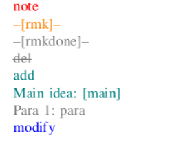

# IEEETrans latex template

- Compile two versions, writing and submission. In writing version, we defined a set of commands to mark changed text. 

- Use make to compile the pdf files.
- Original template in latex_template.tar.gz, which is downloaded from https://www.iccad-conf.com/submission/.

